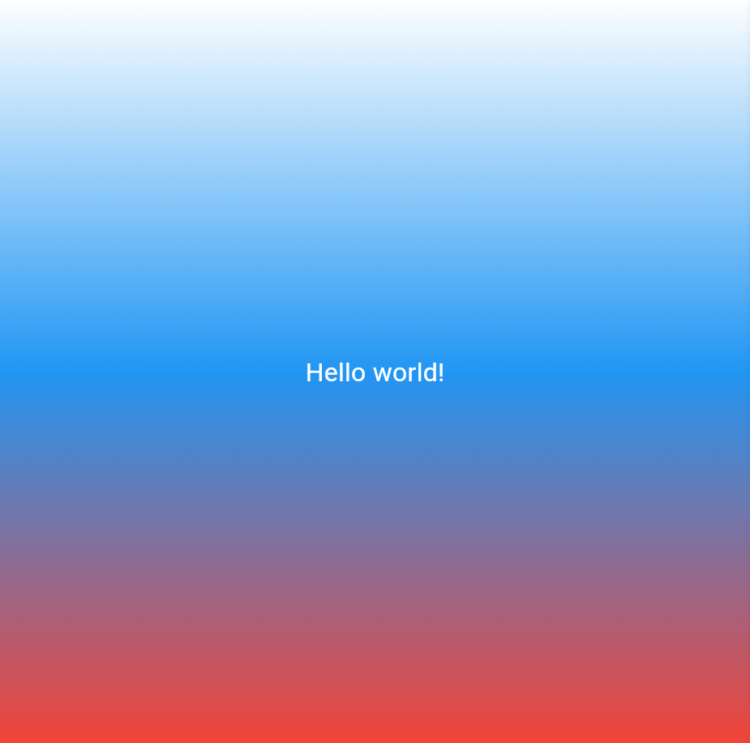

# Лабораторная работа №2. Знакомство с Flutter

## Цель работы: 
Познакомиться с основным инструментом кроссплатформенной разработки — Flutter. Создать и запустить первый Flutter-проект в браузере Chrome, изучить структуру проекта и базовые концепции фреймворка — виджеты и дерево виджетов.

## Необходимые инструменты:
- Flutter 3.35+
- VS Code (рекомендуется для лабораторной работы), либо IntelliJ IDEA /
Android Studio с установленным плагином Flutter
- Git
- Браузер Google Chrome / Edge

## Скриншоты

## Запуск
1. Клонировать репозиторий
2. Перейти в папку проекта
3. Выполнить `flutter pub get`
4. Запустить командой `flutter run -d chrome`

## Что изучили
- Основы кроссплатформенной разработки на Flutter.
- Структура Flutter-проекта (назначение папок и файлов).
- Работа с базовыми виджетами и деревом виджетов.
- Использование базовых команд для сборки и запуска приложения.
- Контроль версий проекта с помощью Git.
